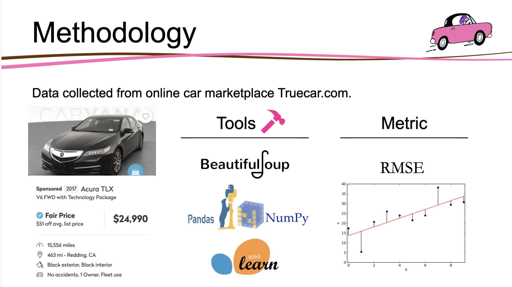
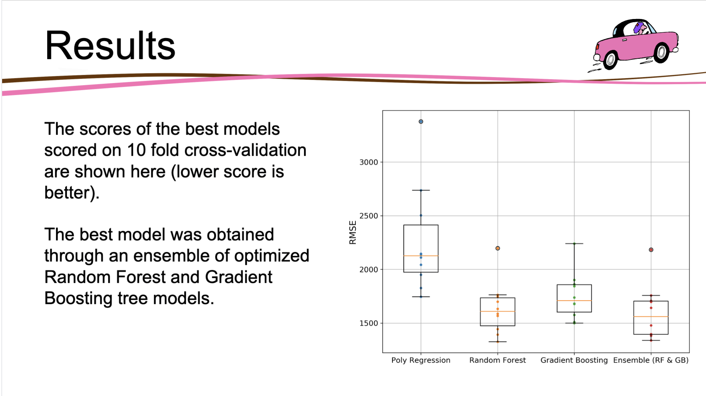
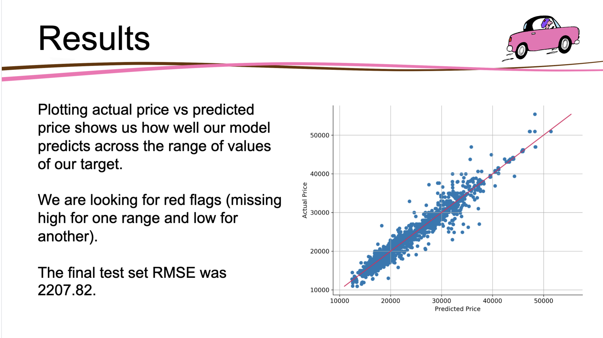
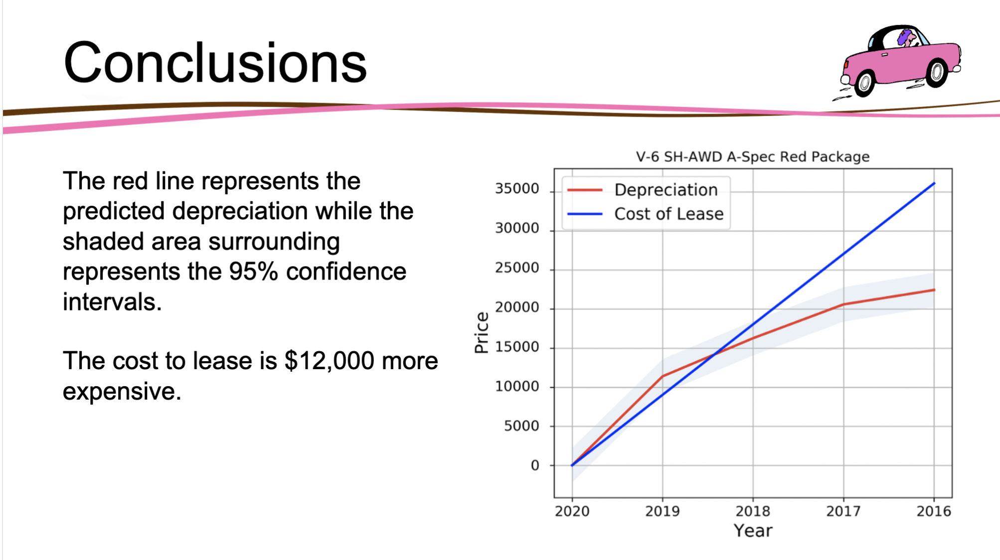

# Should you Buy or Lease your Next Car

# Project Goal

The goal of this project is to determine whether car leases are a good deal by comparing the total expense of a lease with the depreciation cost of a car. If the lease is more expensive we can conclude that it is more cost effective to buy the car new and resell it. However, if the lease is less expensive than we conclude you should lease instead of buy. 

By using Machine Learning we predict the price of cars and use it to calculate the depreciation cost with which we compare to the cost of its lease. 

The metric we use is Root-Mean-Squared-Error (RMSE) because it gives an idea of how much error the system typically makes in its predictions, with a higher weight for larger errors.

The notebook where we webscrape the data can be found [here](https://github.com/lukenew2/automobile-depreciation/blob/master/leases/notebooks/collect_data_webscraping.ipynb).

 

# Results

Notebook complete with code can be found [here](https://github.com/lukenew2/automobile-depreciation/blob/master/leases/notebooks/buy_or_lease.ipynb).

Our first base model is a Linear Regression with which we will try to improve from.  I was able to iterate on top of that and improve performance by a small margin using Polynomial Regression.  However, two models performed significantly better than the linear models, Random Forest Regressor and Gradient Boosting Regressor.  I performed grid searches on both to optimize the hyperparameters and was able to boost performance even more by creating an ensemble of the two best models averaging the predictions.  

The figure below shows the 4 best model's performance score (RMSE) over 10 different folds on the training set.  Using boxplots we can easily see the mean, interquartile range, and min/max scores across all folds. 

 

To analyze errors of best model we plot our predicted price against the actual price. If all of our points were on the diagonal line that would mean our model is perfect and has an error of 0. 

 

This looks pretty good our errors are normally distributed opposed to missing low for one region and high for another.  My model seemed to perform well for the entire range of values.  

# Conclusions

Now back to the original problem. Should you buy or lease your next car? 

Now that we have our final model and performance score on the test set we can use it to predict the prices of Acura TLXs with features corresponding to various leases. The leases we use for comparison are from Acura's website. Let's look at multiple different lease terms and see what we find out!

 

## Write-Ups
- [Should you Buy or Lease Your Next Car?](https://towardsdatascience.com/should-you-buy-or-lease-your-next-car-end-to-end-data-science-project-a26617f11fcb)